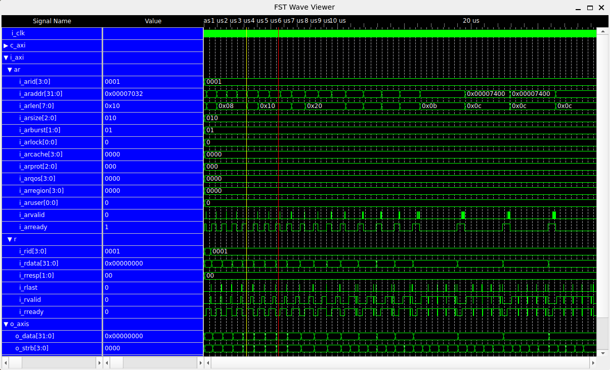

AXI4 Master to Stream Example
==================================================================================

This directory contains an example for PyLogicViewKit using an AXI4 master-to-stream design simulated with NVC.

The example includes an FST waveform file, Python scripts for creating the PyLogicViewKit view model, and a Makefile for generating the waveform data.

Example
----------------------------------------------------------------------------------

Run the waveform viewer with the example view model and FST waveform file:

```console
shell$ python3 -m logic_view_kit.fst_wave_viewer -m axi4_m2s_tb_32_32_256_sync.py
```

The following screenshot shows the AXI4 Master to Stream example displayed with PyLogicViewKit.



Files
----------------------------------------------------------------------------------

### Example Files

* `axi4_m2s_tb_32_32_256_sync.fst` — Example waveform file used by PyLogicViewKit.
* `axi4_m2s_tb_32_32_256_sync.py` — Python scripts for defining the waveform view model.
* `Readme.md` — This document.

### Files Required to Rerun the Simulation

* `Makefile` — Build rules for compiling and simulating the example design and generating the FST waveform file.
* `axi4_master_to_stream_test_bench_32_32_256.snr` - Scenario file required to rerun the simulation.
* `make_scenario.rb` - Ruby script required to regenerate the scenario file.
* `analyze_libs.sh` — Shell script required to rerun the simulation.
* `libs.yml` - YAML file required to regenerate analyze_libs.sh.

Generating the FST File
----------------------------------------------------------------------------------

The FST waveform file can be regenerated using:

```console
shell$ git clone --recursive https://github.com/ikwzm/PipeWorkTest.git
```

```console
shell$ make axi4_m2s_tb_32_32_256_sync
```

This example is intended to demonstrate the basic use of PyLogicViewKit with an RTL simulation waveform.

Generating the FST File
----------------------------------------------------------------------------------

### Requirements

The following software and projects are required:

* nvc          - https://github.com/nickg/nvc.git
* PipeWorkTest - https://github.com/ikwzm/PipeWorkTest.git
* PipeWork     - https://github.com/ikwzm/PipeWork.git
* Dummy_Plug   - https://github.com/ikwzm/Dummy_Plug.git
 
### Downloading PipeWorkTest

PipeWorkTest already includes PipeWork and Dummy_Plug as Git submodules.
Clone the repository recursively as follows:

```console
shell$ git clone --recursive https://github.com/ikwzm/PipeWorkTest.git
```

### Running the Simulation with NVC

```console
shell$ make
sh analyze_libs.sh
nvc -L ./ -M 128M --work=WORK -e  axi4_m2s_tb_32_32_256_sync
nvc -L ./ -M 128M --work=WORK -r --wave=axi4_m2s_tb_32_32_256_sync.fst --format=fst  axi4_m2s_tb_32_32_256_sync
** Note: arrays of composite types such as QUEUE_DATA_VECTOR are not dumped by default, pass 
         --dump-arrays to include these in the waveform dump
        35 ns| MARCHAL < AXI4_M2S_TEST I_DATA_WIDTH=32 O_DATA_WIDTH=32 MAX_XFER_SIZE=256
        55 ns| MARCHAL < AXI4_M2S_TEST.4.0
       805 ns| MARCHAL < AXI4_M2S_TEST.4.1
      1565 ns| MARCHAL < AXI4_M2S_TEST.4.2
      2325 ns| MARCHAL < AXI4_M2S_TEST.4.3
      3085 ns| MARCHAL < AXI4_M2S_TEST.4.4
      3915 ns| MARCHAL < AXI4_M2S_TEST.4.5
      4755 ns| MARCHAL < AXI4_M2S_TEST.4.6
      5595 ns| MARCHAL < AXI4_M2S_TEST.4.7
      6435 ns| MARCHAL < AXI4_M2S_TEST.4.8
      7425 ns| MARCHAL < AXI4_M2S_TEST.4.9
      8425 ns| MARCHAL < AXI4_M2S_TEST.4.10
      9425 ns| MARCHAL < AXI4_M2S_TEST.4.11
     10425 ns| MARCHAL < AXI4_M2S_TEST.4.12
     11765 ns| MARCHAL < AXI4_M2S_TEST.4.13
     13125 ns| MARCHAL < AXI4_M2S_TEST.4.14
     14485 ns| MARCHAL < AXI4_M2S_TEST.4.15
     15845 ns| MARCHAL < AXI4_M2S_TEST.4.16
     19195 ns| MARCHAL < AXI4_M2S_TEST.4.17
     22595 ns| MARCHAL < AXI4_M2S_TEST.4.18
     25995 ns| MARCHAL < AXI4_M2S_TEST.4.19
  ***  
  ***  ERROR REPORT AXI4_MASTER_TO_STREAM_TEST_BENCH_32_32_256_SYNC
  ***  [ CSR ]
  ***    Error    : 0
  ***    Mismatch : 0
  ***    Warning  : 0
  ***  
  ***  [ IN ]
  ***    Error    : 0
  ***    Mismatch : 0
  ***    Warning  : 0
  ***  
  ***  [ OUT ]
  ***    Error    : 0
  ***    Mismatch : 0
  ***    Warning  : 0
  ***  
** Note: 29376ns+0: Simulation complete(success).
```

